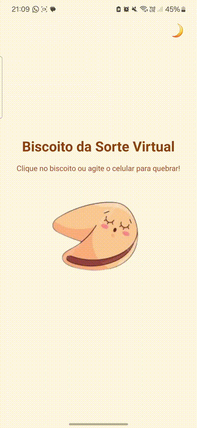

# 🥠 FortuneCookie App - Biscoito da Sorte Virtual

## 📝 Descrição Curta

FortuneCookie App é um aplicativo móvel desenvolvido em React Native com Expo, onde o usuário pode "quebrar" um biscoito da sorte virtual para receber uma frase inspiradora ou divertida (com uma pegada "badass"!). O app também reage ao gesto de chacoalhar o celular para quebrar o biscoito e possui um seletor de tema claro/escuro para personalizar a experiência.

## ✨ Funcionalidades Principais

* **Quebrar o Biscoito:** Clique no biscoito ou chacoalhe o celular para reveler sua sorte.
* **Frases Aleatórias:** Uma coleção de frases para te inspirar ou divertir.
* **Gesto de Chacoalhar:** Interaja com o app de forma mais física!
* **Alternador de Tema:** Escolha entre um tema claro (Light Mode) e um tema escuro (Dark Mode) minimalista.
* **Interface Intuitiva:** Design simples e direto ao ponto.

## 📸 Visualização



## 🛠️ Tecnologias Utilizadas

* [React Native](https://reactnative.dev/)
* [Expo](https://expo.dev/)
* JavaScript
* [Expo Sensors (Accelerometer)](https://docs.expo.dev/versions/latest/sdk/accelerometer/) para a funcionalidade de chacoalhar.
* React Hooks (`useState`, `useEffect`, `useRef`) para gerenciamento de estado e ciclo de vida.
* StyleSheet do React Native para estilização dinâmica.

## 🚀 Como Executar o Projeto Localmente

Siga estas instruções para rodar o projeto no seu ambiente de desenvolvimento.

### Pré-requisitos

* [Node.js](https://nodejs.org/) (versão LTS recomendada)
* npm (geralmente vem com o Node.js) ou [Yarn](https://yarnpkg.com/)
* [Expo CLI](https://docs.expo.dev/get-started/installation/):
    ```bash
    npm install -g expo-cli
    ```
* Aplicativo Expo Go instalado no seu celular (Android ou iOS).

### Configuração

1.  **Clone este repositório** (ou baixe os arquivos do projeto):
    ```bash
    # Se estiver usando Git
    # git clone https://SEU_LINK_DO_REPOSITORIO_AQUI.git
    # cd nome-do-projeto
    ```
    *Se você não tem um repositório Git, apenas certifique-se de que os arquivos do projeto estão em uma pasta local.*

2.  **Instale as dependências:**
    Navegue até a pasta raiz do projeto no seu terminal e execute:
    ```bash
    npm install
    ```
    ou, se estiver usando Yarn:
    ```bash
    yarn install
    ```

3.  **Adicione as imagens dos biscoitos:**
    * Crie uma pasta chamada `assets` na raiz do seu projeto (se ainda não existir).
    * Coloque as imagens do biscoito dentro desta pasta. O código espera os seguintes nomes:
        * `biscoito_fechado.png`
        * `biscoito_aberto.png`
    * *Certifique-se de que os nomes e caminhos correspondem aos usados no arquivo `App.js`.*

### Rodando o App

1.  Com as dependências instaladas e as imagens no lugar, inicie o servidor de desenvolvimento do Expo:
    ```bash
    npx expo start
    ```
    ou
    ```bash
    yarn expo start
    ```
2.  Um código QR aparecerá no seu terminal e no navegador que abrir.
3.  Abra o aplicativo **Expo Go** no seu celular e escaneie o código QR.
4.  O aplicativo FortuneCookie deverá carregar no seu dispositivo.

## 🎮 Como Usar o App

* **Quebrar o Biscoito:**
    * Clique na imagem do biscoito fechado.
    * OU, chacoalhe seu celular.
* **Nova Sorte:** Após o biscoito quebrar, clique na imagem do biscoito aberto para receber uma nova frase.
* **Mudar Tema:** Clique no emoji (☀️/🌙) no canto superior direito para alternar entre o tema claro e escuro.
* **Novo Biscoito:** Se quiser começar de novo, clique no botão "Novo Biscoito" que aparece após o biscoito ser quebrado.

## 🎨 Customização

Você pode facilmente personalizar alguns aspectos do app:

### Alterar Frases da Sorte

1.  Abra o arquivo `App.js`.
2.  Encontre a constante `fortunes` (um array de strings).
3.  Adicione, remova ou edite as frases dentro deste array.

### Alterar Imagens do Biscoito

1.  Substitua os arquivos `biscoito_fechado.png` e `biscoito_aberto.png` na pasta `assets` pelas suas imagens.
2.  Se usar nomes de arquivo diferentes, atualize as linhas correspondentes no início do `App.js`:
    ```javascript
    const closedCookieImage = require('./assets/SEU_NOVO_NOME_FECHADO.png');
    const openCookieImage = require('./assets/SEU_NOVO_NOME_ABERTO.png');
    ```

### Ajustar Sensibilidade do Chacoalhar

1.  No `App.js`, encontre a constante `SHAKE_THRESHOLD`.
2.  Aumente o valor para tornar o chacoalhar menos sensível, ou diminua para torná-lo mais sensível.

### Alterar Cores dos Temas

1.  No `App.js`, localize os objetos `lightThemeColors` e `darkThemeColors`.
2.  Altere os códigos hexadecimais das cores para personalizar a aparência de cada tema.

## 💡 Próximos Passos / Melhorias Futuras (Sugestões)

* Adicionar animações mais elaboradas para a "quebra" do biscoito.
* Buscar frases de uma API externa.
* Permitir que o usuário adicione suas próprias frases.
* Salvar a preferência de tema do usuário entre as sessões (usando `AsyncStorage`).
* Internacionalização (suporte a múltiplos idiomas).

## 👤 Autora

* **Kamila Silva**
* LinkedIn: `https://www.linkedin.com/in/kamila-alves-silva/`

## 📄 Licença

Este projeto pode ser distribuído sob a licença MIT. Veja o arquivo [LICENSE](LICENSE) para mais detalhes.